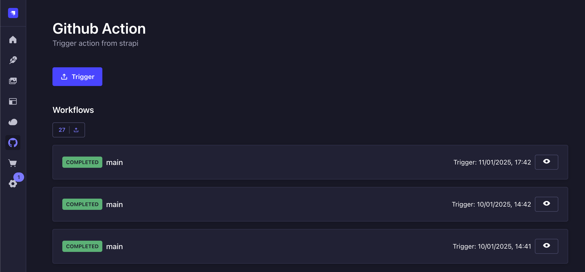

# Strapi GitHub Plugin Action

This plugin can trigger github workflow action from strapi admin panel.
You can see the last 3 runs.



## How to install
```bash
npm install strapi-plugin-github-action

yarn add strapi-plugin-github-action

bun install strapi-plugin-github-action
```

## How to configure
Edit `config/plugins.ts` and add 

```ts
export default ({env}) => ({
  "github-action": {
    enabled: true,
    config: {
      owner: env("GITHUB_OWNER"),
      repo: env("GITHUB_REPO"),
      token: env("GITHUB_TOKEN"),
      branch: env("GITHUB_BRANCH", "main"),
      workflowId: env("GITHUB_WORKFLOW_ID"),
    }
  }
});

```

Then add environments on `.env`
```dotenv
# Github Action
GITHUB_OWNER=
GITHUB_REPO=your-code-repo
GITHUB_BRANCH=main
GITHUB_TOKEN=
GITHUB_WORKFLOW_ID=deploy.yml
```

`GITHUB_WORKFLOW_ID` can be the id or the name of github workflow file name.

